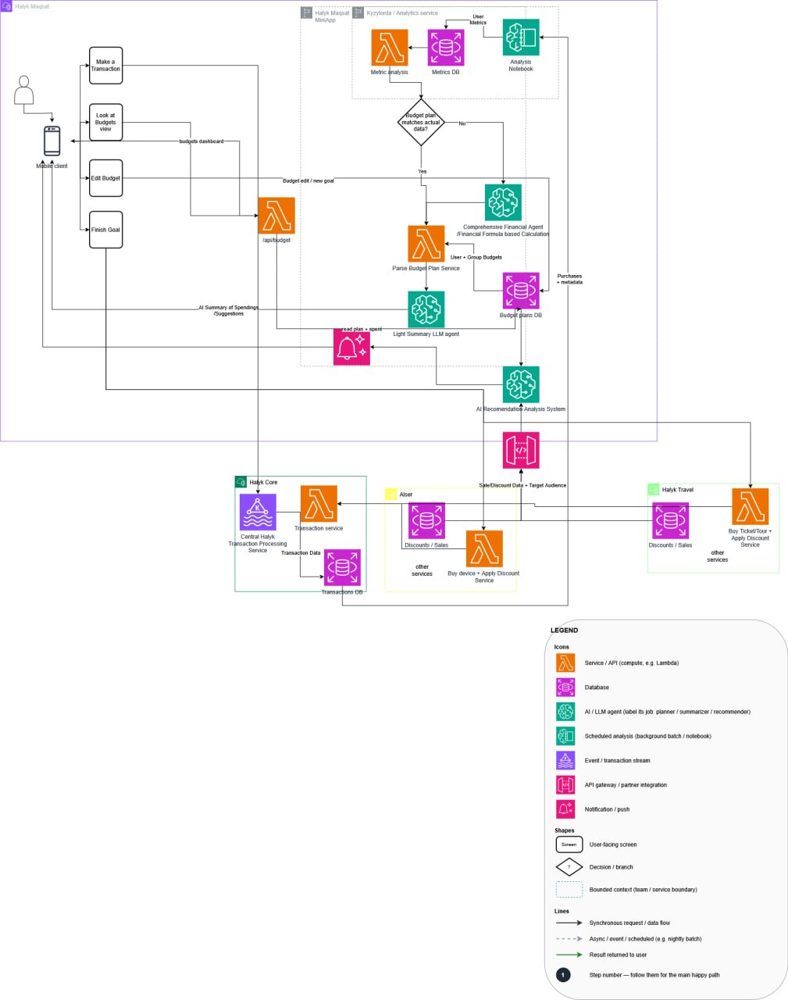

# Maqsat & Family

**Интеллектуальная система управления личными и семейными финансами** — надстройка над Halyk SuperApp.
Превращает пассивный банковский счёт в проактивного финансового помощника: AI-бюджетирование, накопительные цели и семейный контур с детскими лимитами и SOS-одобрением платежей.



> Полная спецификация: [docs/ARCHITECTURE.md](docs/ARCHITECTURE.md) · AI-плоскость: [docs/AI_AND_ANALYTICS_USAGE.md](docs/AI_AND_ANALYTICS_USAGE.md)

---

## Что умеет система

| Блок | Суть |
|---|---|
| **AI-бюджетирование** | Доход разбивается на категории агентом; траты автоматически категоризируются по MCC и трекаются против плана |
| **Цели / Maqsat** | Накопления на виртуальных счетах с прогрессом и бонусными программами |
| **Family** | Семейные группы, роли adult/child, дневные лимиты ребёнка и **конфликтный сценарий**: ребёнок упёрся в лимит на кассе → SOS родителю → одобрение в один тап |
| **AI-плоскость** | Drift-детекция → автоматический ре-план бюджета (OpenAI); мультиязычные финансовые отчёты; таргетинг партнёрских предложений (Alser, Halyk Travel) |

### Ключевые принципы

- **Виртуальный слой** — деньги остаются на основном счёте; семейные/целевые счета — маска через API, процессинг банка не трогается
- **Без передачи паролей** — участники добавляются по инвайту и логинятся сами; временный пароль с принудительной сменой
- **Роли в домене** — `adult`/`child` живут в `family-service`, Keycloak отвечает только «кто ты»
- **Soft-block вместо decline** — превышение лимита ребёнком даёт статус `PENDING_APPROVAL`, не `DECLINED`; родитель одобряет в один тап и это действует до конца дня

---

## Стек

| Слой | Технологии |
|---|---|
| Язык / сборка | Java 21, Gradle (Kotlin DSL), multi-module monorepo |
| Framework | Spring Boot 3.4.1, Spring Cloud 2024.0.0 |
| Gateway | Spring Cloud Gateway (reactive/WebFlux) + Netflix Eureka |
| База данных | PostgreSQL 16, database-per-service, Flyway-миграции |
| Брокер | Apache Kafka 3.9 (KRaft, без ZooKeeper) |
| Identity | Keycloak 26 (OIDC), OAuth2 resource server на каждом сервисе |
| AI | OpenAI `gpt-4o-mini` (financial-agent, summary-llm, recommendation), Anthropic (ai-assistant) |
| Frontend | React 19, TypeScript, Vite, Tailwind CSS 4, TanStack Query 5 |
| Observability | Micrometer + OTel → Prometheus / Tempo / Loki / Grafana / Alloy |

---

## Сервисы

### Транзакционная плоскость

| Сервис | Порт | БД | Назначение |
|---|---|---|---|
| `gateway` | 8080 | — | Маршрутизация `/api/<svc>/**` + JWT-валидация |
| `eureka-server` | 8761 | — | Service discovery |
| `auth-service` | 8089 | — | Онбординг и инвайт-флоу (Keycloak Admin API) |
| `transaction-service` | 8083 | transaction_db | Транзакции + MCC-категоризация; Kafka producer |
| `budget-service` | 8082 | budget_db | Планы, категории, лимиты, трекинг; Kafka consumer |
| `goals-service` | 8084 | goals_db | Цели и виртуальные счета |
| `family-service` | 8085 | family_db | Группы, роли, детские лимиты, SOS-одобрение |
| `notification-service` | 8087 | — | Push-уведомления и SOS-алерты через Kafka |

### AI и аналитическая плоскость

| Сервис | Порт | БД | Назначение |
|---|---|---|---|
| `analytics-service` | 8090 | analytics_db | Вычисление метрик, drift-детекция |
| `ai-assistant-service` | 8086 | — | LLM-оркестратор (Anthropic) |
| `financial-agent-service` | 8091 | priors_db | OpenAI ре-план при drift |
| `summary-llm-service` | 8092 | — | Мультиязычные AI-отчёты (ru/kk/en) |
| `recommendation-service` | 8093 | analytics_db | Таргетинг партнёрских предложений через OpenAI |
| `parse-budget-plan-service` | 8094 | — | Валидация и сохранение ре-плана от financial-agent |

### Экосистемная плоскость

| Сервис | Порт | БД | Назначение |
|---|---|---|---|
| `integration-service` | 8088 | — | Бонусы и офферы партнёров (stub) |
| `alser-mock-service` | 8095 | alser_db | Каталог электроники Alser |
| `halyk-travel-mock-service` | 8096 | travel_db | Каталог авиа/отель/тур Halyk Travel |
| `frontend` | 8090/80 | — | React SPA, proxies `/api` → gateway |

> Только `gateway`, `keycloak`, `eureka-server` публикуют хост-порты. Остальные сервисы доступны изнутри сети через `lb://<svc>` и снаружи только через gateway (`:8080`).

---

## Быстрый старт

### Требования

- Docker + Docker Compose
- Java 21 (для сборки)
- `.env` файл (скопируй из `.env.example`)

### Первый запуск

```bash
cp .env.example .env
# Заполни OPENAI_API_KEY, ANTHROPIC_API_KEY, DATABASE_PASSWORD в .env

docker compose up --build
```

### Быстрый режим (рекомендуется для разработки)

Собирает jar'ы локально и запускает их в лёгких JRE-контейнерах — намного быстрее:

```bash
./gradlew build
docker compose -f docker-compose.yml -f docker-compose.dev.yml up -d
```

### С observability (Grafana, Prometheus, Loki, Tempo)

```bash
docker compose -f docker-compose.yml -f docker-compose.dev.yml \
               -f docker-compose.observability.yml up -d
```

После запуска (~60 с на инициализацию Keycloak):

| Адрес | Что |
|---|---|
| http://localhost:8080/swagger-ui.html | Агрегированный Swagger UI всех сервисов |
| http://localhost:8080 | Gateway (все API через него) |
| http://localhost:8081 | Keycloak Admin (admin / admin) |
| http://localhost:8761 | Eureka Dashboard |
| http://localhost:3000 | Grafana (anonymous Admin, только с observability overlay) |

---

## Сборка и тесты

```bash
./gradlew build                                                    # все модули
./gradlew :budget-service:build                                    # один сервис
./gradlew :transaction-service:test --tests "CategorizationEngineTest"
```

После изменения кода в dev-режиме:

```bash
./gradlew :<svc>:build
docker compose -f docker-compose.yml -f docker-compose.dev.yml restart <svc>
```

---

## Демо

### Полный сквозной сценарий

```bash
bash demo/run-demo.sh       # бюджет + семья + конфликтный сценарий + AI
bash demo/run-ai-plane.sh   # AI-плоскость: drift → ре-план → отчёт → рекомендации
```

### Вручную — получить токен

```bash
TOKEN=$(curl -s -X POST http://localhost:8081/realms/maqsat/protocol/openid-connect/token \
  -d grant_type=password -d client_id=maqsat-app \
  -d username=papa -d password=papa | python -c "import sys,json;print(json.load(sys.stdin)['access_token'])")
```

### 1. Бюджет и категоризация

```bash
# Создать план (категории на русском — через файл, чтобы не сломал shell)
curl -s -X POST http://localhost:8080/api/budget/plan \
  -H "Authorization: Bearer $TOKEN" -H "Content-Type: application/json; charset=utf-8" \
  --data-binary @demo/plan.json

# Провести транзакцию (MCC 5411 → «Продукты»)
curl -s -X POST http://localhost:8080/api/transactions \
  -H "Authorization: Bearer $TOKEN" -H "Content-Type: application/json" \
  --data-binary '{"accountId":"acc-1","amount":5000,"merchant":"MAGNUM","mcc":"5411"}'

# Посмотреть дашборд
curl -s http://localhost:8080/api/budget/dashboard -H "Authorization: Bearer $TOKEN"
```

### 2. Семья и инвайт

```bash
GID=$(curl -s -X POST http://localhost:8080/api/family/groups \
  -H "Authorization: Bearer $TOKEN" -H "Content-Type: application/json" \
  --data-binary '{"name":"Maqsat Family"}' | python -c "import sys,json;print(json.load(sys.stdin)['id'])")

# Создаёт ребёнка в Keycloak (временный пароль + UPDATE_PASSWORD) и CHILD-мемберство
curl -s -X POST http://localhost:8080/api/auth/invite \
  -H "Authorization: Bearer $TOKEN" -H "Content-Type: application/json" \
  --data-binary "{\"groupId\":\"$GID\",\"username\":\"bala-jr\",\"role\":\"CHILD\",\"dailyLimit\":2500}"
```

### 3. Конфликтный сценарий (SOS)

```bash
CHILD_TOKEN=$(curl -s -X POST http://localhost:8081/realms/maqsat/protocol/openid-connect/token \
  -d grant_type=password -d client_id=maqsat-app -d username=child -d password=child \
  | python -c "import sys,json;print(json.load(sys.stdin)['access_token'])")

# Ребёнок пытается потратить 5000 при лимите 3000 → PENDING_APPROVAL + SOS родителю
TXN_ID=$(curl -s -X POST http://localhost:8080/api/transactions \
  -H "Authorization: Bearer $CHILD_TOKEN" -H "Content-Type: application/json" \
  --data-binary '{"accountId":"child-acc","amount":5000,"merchant":"Sushi Bar","mcc":"5812"}' \
  | python -c "import sys,json;print(json.load(sys.stdin)['id'])")

# Родитель одобряет в один тап → транзакция POSTED
curl -s -X POST http://localhost:8080/api/family/approvals/$TXN_ID \
  -H "Authorization: Bearer $TOKEN" -H "Content-Type: application/json" \
  --data-binary "{\"childUserId\":\"...\",\"approvedAmount\":5000}"
```

### 4. AI ре-план бюджета

```bash
# Запустить AI-плоскость вручную (после накопления трат с drift)
curl -s -X POST "http://localhost:8080/api/analytics/metrics/$USER_ID/2025-05/recompute" \
  -H "Authorization: Bearer $TOKEN"

# Через ~8с: новый план version=2, created_by_ai=true
curl -s http://localhost:8080/api/budget/dashboard -H "Authorization: Bearer $TOKEN"
```

---

## Observability

Каждый сервис экспортирует три сигнала:

- **Метрики** → Micrometer → `/actuator/prometheus` → Prometheus (Eureka SD)
- **Трейсы** → OTel → Tempo (один трейс охватывает `gateway → transaction → Kafka → budget/notification`)
- **Логи** → ECS JSON с `traceId`/`spanId` → Alloy → Loki

Дашборды Grafana (папка **Maqsat**):

| Дашборд | Что показывает |
|---|---|
| [Overview](http://localhost:3000/d/maqsat-overview) | Статус сервисов, HTTP rate и p95, JVM heap, логи с кликабельным TraceID |
| [Service Graph & Traces](http://localhost:3000/d/maqsat-service-graph) | Node Graph трейсов, Kafka-рёбра `transaction → notification`, span call rates |
| [Business Metrics](http://localhost:3000/d/maqsat-business) | Транзакции по статусам, SOS-события, одобрения, расходы по категориям, AI plane метрики |

---

## Gotchas

| Проблема | Решение |
|---|---|
| 503 после рестарта | Gateway LB-кеш лагает ~30 с — подождать, не искать баг |
| Кириллица превращается в `?` | Слать JSON через файл: `--data-binary @demo/plan.json` |
| `curl localhost:8089` не отвечает | Сервисы не публикуют хост-порты — использовать `localhost:8080/api/...` |
| `sub` пропадает из JWT | Не переопределять `defaultClientScopes` в `docs/keycloak/realm-export.json` |
| Postgres на 5432 уже занят | `.env` выставляет `POSTGRES_HOST_PORT=5433` для хоста; внутри сети — `postgres:5432` |

---

## Структура репозитория

```
halyk-oiy/
├── common/                     # Kafka-контракты, ApiError, CurrentUser (java-library)
├── gateway/                    # Spring Cloud Gateway
├── <service-name>/             # По одному Gradle-модулю на сервис
├── frontend/                   # React SPA
├── demo/                       # Демо-скрипты и JSON-фикстуры
├── docs/
│   ├── ARCHITECTURE.md         # Полная тех. спецификация с ER-диаграммами
│   ├── AI_AND_ANALYTICS_USAGE.md
│   ├── architecture.jpg        # Диаграмма архитектуры
│   ├── keycloak/               # realm-export.json (монтируется в Keycloak)
│   ├── db/                     # init-databases.sql (монтируется в PostgreSQL)
│   └── observability/          # Конфиги Prometheus, Loki, Tempo, Alloy, Grafana
├── docker-compose.yml
├── docker-compose.dev.yml      # Overlay: готовые jar вместо сборки образов
├── docker-compose.observability.yml
├── Dockerfile                  # Общий, ARG MODULE выбирает сервис
├── build.gradle.kts
└── settings.gradle.kts
```
