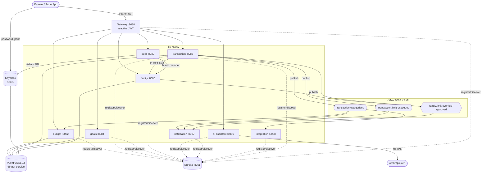
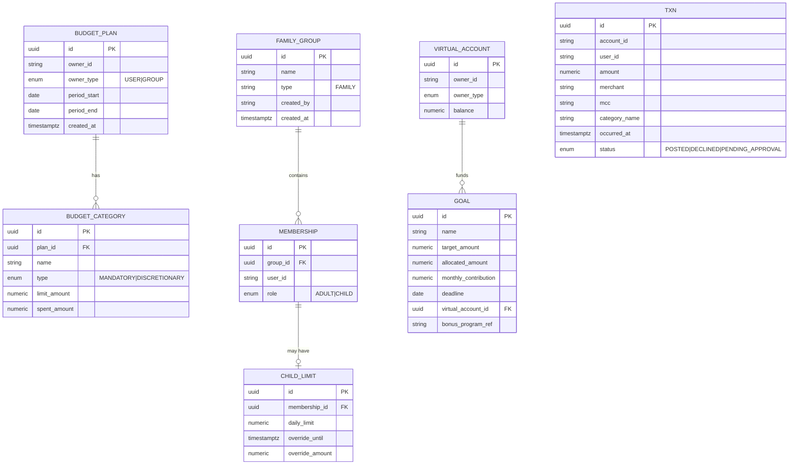
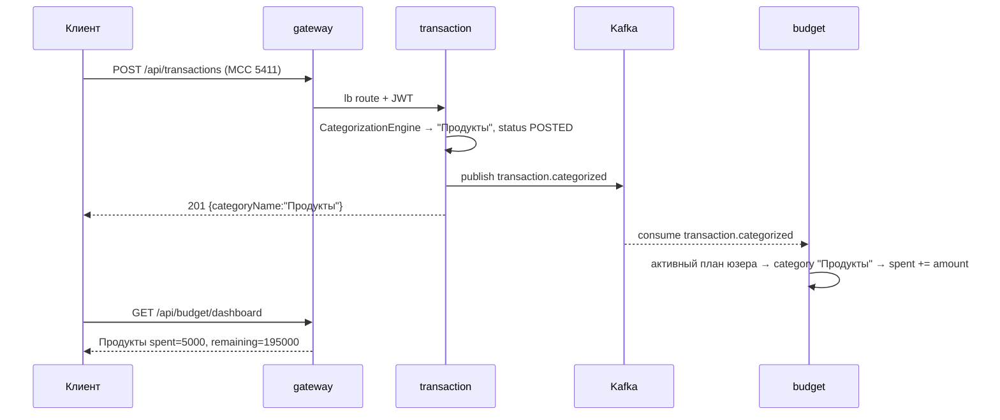
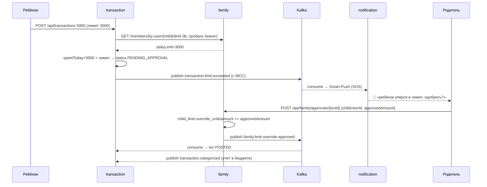
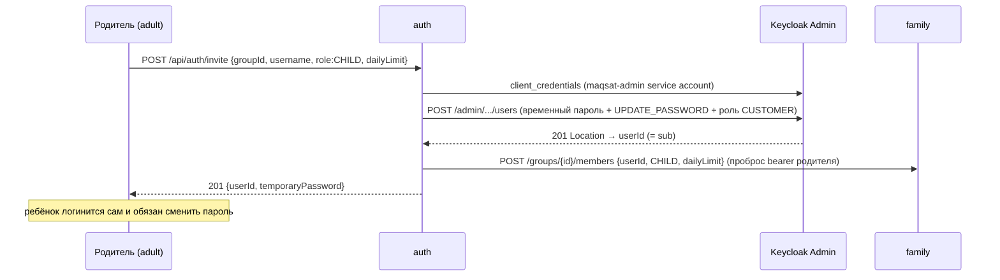

# Maqsat & Family — Архитектура и техническая спецификация

Дополнение к Halyk SuperApp: AI-бюджетирование, цели/накопления (Maqsat) и семейный контур
(Family) с детскими лимитами и сценарием «ребёнок упёрся в лимит на кассе → SOS родителю → одобрение в один тап».

---

## 1. Обзор и продуктовый контекст

Три продуктовых блока поверх существующего банка:

1. **AI-бюджетирование** — доход разбивается на категории; траты автоматически категоризируются
   (по MCC) и трекаются против бюджета.
2. **Цели / Maqsat** — накопления на виртуальных счетах с прогрессом.
3. **Family** — семейный контур: общие группы, роли adult/child, дневные лимиты ребёнка и
   **конфликтный сценарий одобрения** платежа родителем.

### Принципы архитектуры

| Принцип | Реализация |
|---|---|
| **Виртуальный слой** | Деньги физически на основном счёте; семейные/целевые счета — виртуальные, лимиты накладываются маской через API. Процессинг банка не трогается. |
| **Без передачи логина/пароля** | Участники добавляются по инвайту; каждый логинится сам. Приглашённому создаётся временный пароль с обязательной сменой (`requiredActions: UPDATE_PASSWORD`). |
| **Роли живут в домене** | `adult/child` хранятся в `family-service` (привязаны к membership группы), НЕ в Keycloak. Keycloak отвечает только «кто ты». |
| **Тонкий `common`** | Только контракты событий, `ApiError`, `CurrentUser`. Без бизнес-логики. |
| **Состояние через события** | Межсервисное состояние — через Kafka; синхронные чтения — REST/WebClient через Eureka (`lb://`). |

---

## 2. Технологический стек

| Слой | Технология |
|---|---|
| Язык / сборка | Java 21, Gradle (Kotlin DSL), multi-module monorepo |
| Framework | Spring Boot 3.4.1, Spring Cloud 2024.0.0 |
| API gateway | Spring Cloud Gateway (reactive / WebFlux) |
| Service discovery | Netflix Eureka |
| БД | PostgreSQL 16, database-per-service, Flyway-миграции |
| Брокер | Apache Kafka 3.9 (KRaft, без ZooKeeper), Spring Kafka, JSON-сериализация |
| Identity | Keycloak 26 (OIDC); каждый сервис — OAuth2 resource server |
| Observability | Micrometer + OpenTelemetry → Prometheus / Tempo / Loki / Grafana / Alloy |
| Прочее | Lombok, springdoc-openapi, structured logging (ECS JSON) |

---

## 3. Каталог сервисов

| Сервис | Порт | БД | Назначение | Kafka | Внешние вызовы |
|---|---|---|---|---|---|
| **eureka-server** | 8761 | — | Реестр сервисов | — | — |
| **gateway** | 8080 | — | Маршрутизация `/api/<svc>/**` + проверка JWT | — | — |
| **keycloak** | 8081 | keycloak_db | IdP (OIDC) | — | — |
| **budget-service** | 8082 | budget_db | Планы, категории, лимиты, трекинг | consumer | — |
| **transaction-service** | 8083 | transaction_db | Транзакции + categorization engine | producer+consumer | → family-service (lb) |
| **goals-service** | 8084 | goals_db | Цели, виртуальные счета | — | — |
| **family-service** | 8085 | family_db | Группы, роли, детские лимиты, SOS-одобрение | producer | — |
| **ai-assistant-service** | 8086 | — | LLM-оркестратор (Anthropic) | — | → api.anthropic.com |
| **notification-service** | 8087 | — | Push-имитация / Smart-Push | consumer | — |
| **integration-service** | 8088 | — | Бонусы/офферы (stub) | consumer | — |
| **auth-service** | 8089 | — | Онбординг/инвайты | — | → Keycloak Admin API, family-service (lb) |

Пакеты: `kz.halyk.maqsat.<svc>`, внутри `config / controller / service / repository / domain / dto / event / exception / client`.

---

## 4. Контейнерная диаграмма



---

## 5. Модель данных (Flyway `V1__init.sql` на сервис; `id uuid pk default gen_random_uuid()`)

### budget_db
```
budget_plan(id, owner_id, owner_type[USER|GROUP], period_start date, period_end date, created_at timestamptz)
budget_category(id, plan_id → budget_plan, name, type[MANDATORY|DISCRETIONARY],
                limit_amount numeric(15,2), spent_amount numeric(15,2) default 0)
```

### transaction_db
```
txn(id, account_id, user_id, amount numeric(15,2), merchant, mcc, category_name,
    occurred_at timestamptz, status[POSTED|DECLINED|PENDING_APPROVAL])
```

### goals_db
```
virtual_account(id, owner_id, owner_type, balance numeric(15,2) default 0)
goal(id, name, description, category, target_amount, allocated_amount default 0,
     monthly_contribution, deadline date, virtual_account_id → virtual_account,
     bonus_program_ref, created_at)
```

### family_db
```
family_group(id, name, type default 'FAMILY', created_by, created_at)
membership(id, group_id → family_group, user_id, role[ADULT|CHILD], UNIQUE(group_id,user_id))
child_limit(id, membership_id → membership UNIQUE, daily_limit numeric(15,2),
            override_until timestamptz, override_amount numeric(15,2))
```

Конвенции JPA: `@GeneratedValue(strategy = UUID)`, enum `@Enumerated(STRING)`, `ddl-auto: validate`,
camelCase → snake_case, `hibernate.jdbc.time_zone = UTC`.

### ER-диаграмма

БД изолированы (database-per-service); внутри каждой — свои FK, между сервисами связь только по
`user_id` / `group_id` (пунктир — логические, не FK).



> Связи между БД (по значению, без FK): `budget_plan.owner_id`, `txn.user_id`, `virtual_account.owner_id`,
> `membership.user_id` — это Keycloak `sub`; `owner_type=GROUP` ссылается на `family_group.id`.

---

## 6. API-спецификация (все под `/api`, требуют Bearer JWT, кроме `/actuator`, `/swagger-ui`, `/v3/api-docs`)

### budget-service
| Метод | Путь | Тело | Ответ |
|---|---|---|---|
| POST | `/api/budget/plan` | `{periodStart, periodEnd, categories:[{name,type,limitAmount}]}` | `201` planId (UUID) |
| GET | `/api/budget/dashboard` | — | `{planId, periodStart, periodEnd, totalLimit, totalSpent, categories:[{name,type,limit,spent,remaining}]}` |

### transaction-service
| Метод | Путь | Тело | Ответ |
|---|---|---|---|
| POST | `/api/transactions` | `{accountId, amount, merchant, mcc, occurredAt?}` | `201` `{id,…,categoryName,status}` |
| GET | `/api/transactions` | — | список транзакций пользователя |

### goals-service
| Метод | Путь | Тело | Ответ |
|---|---|---|---|
| POST | `/api/goals` | `{name, description?, category?, targetAmount, monthlyContribution?, deadline?, bonusProgramRef?}` | `201` GoalResponse |
| GET | `/api/goals` | — | список целей с `progressPercent`, `virtualAccountBalance` |
| POST | `/api/goals/{id}/contribute` | `{amount}` | GoalResponse |

### family-service
| Метод | Путь | Тело | Ответ |
|---|---|---|---|
| POST | `/api/family/groups` | `{name}` | `201` GroupResponse (создатель → ADULT) |
| POST | `/api/family/groups/{id}/members` | `{userId, role, dailyLimit?}` | `201` GroupResponse |
| GET | `/api/family/groups/{id}` | — | GroupResponse с members |
| PUT | `/api/family/members/{id}/limit` | `{dailyLimit}` | GroupResponse |
| GET | `/api/family/members/by-user/{userId}/limit` | — | `{userId, dailyLimit, overrideUntil, overrideAmount}` (для transaction-service) |
| POST | `/api/family/approvals/{transactionId}` | `{childUserId, approvedAmount}` | ApprovalResponse + publish event |

### auth-service
| Метод | Путь | Тело | Ответ |
|---|---|---|---|
| POST | `/api/auth/invite` | `{groupId, username, email?, firstName?, lastName?, role, dailyLimit?}` | `201` `{userId, temporaryPassword, role, groupId, message}` |

### ai-assistant-service
| Метод | Путь | Тело | Ответ |
|---|---|---|---|
| POST | `/api/ai/budget-plan` | `{monthlyIncome, recentSpending?}` | `{categories:[{name,type,limitAmount}], rationale}` |
| POST | `/api/ai/chat` | `{currentPlan, history?, message}` | `{reply, updatedPlan}` |

### integration-service
| Метод | Путь | Ответ |
|---|---|---|
| GET | `/api/integration/offers` | список офферов (stub, permitAll) |

---

## 7. Контракты событий (records в `common`, JSON, `add.type.headers=false`, ключ = userId)

| Запись | Топик | Поля |
|---|---|---|
| `TransactionCategorized` | `transaction.categorized` | `transactionId, userId, accountId, amount, mcc, categoryName, occurredAt` |
| `LimitExceeded` | `transaction.limit-exceeded` | `transactionId, childUserId, accountId, attemptedAmount, dailyLimit, shortfall, mcc, merchant` |
| `LimitOverrideApproved` | `family.limit-override-approved` | `transactionId, childUserId, approvedAmount, approvedByUserId` |

**Kafka-конфиг.** Producer: `JsonSerializer` + `spring.json.add.type.headers=false`, `KafkaTemplate<String,Object>`.
Consumer одного типа (budget): `JsonDeserializer` + `spring.json.value.default.type=<FQN>` + `use.type.headers=false`
+ `trusted.packages=kz.halyk.maqsat.common.event`. Consumer нескольких типов (notification, integration):
`ByteArrayDeserializer` + `ByteArrayJsonMessageConverter` (тип берётся из сигнатуры @KafkaListener).
Трейс-контекст пробрасывается через Kafka-заголовки (`spring.kafka.{template,listener}.observation-enabled=true`).

---

## 8. Categorization Engine (transaction-service)

MCC → категория, далее эвристика по мерчанту, иначе `Прочее`:

| MCC | Категория |
|---|---|
| 5411, 5412, 5499 | Продукты |
| 5541, 5542 | Транспорт |
| 4111, 4121 | Такси |
| 5812, 5814 | Рестораны |
| 4900 | Коммуналка |
| 7997, 7991 | Развлечения |
| — (фолбэк) | по ключевым словам мерчанта → иначе **Прочее** |

Имена категорий совпадают с бюджетными (важно для трекинга через `equalsIgnoreCase`).

---

## 9. Ключевые потоки

### 9.1 Трекинг бюджета


### 9.2 Конфликтный сценарий (ядро продукта)


### 9.3 Онбординг по инвайту (без передачи пароля)


---

## 10. Безопасность

- **Keycloak realm `maqsat`**, клиенты:
  - `maqsat-app` — public, `standardFlow` + `directAccessGrants` (password grant для демо), redirectUris `*`.
  - `maqsat-admin` — confidential, `serviceAccountsEnabled`, secret `maqsat-admin-secret`; на сервис-аккаунте
    realm-management роли `manage-users`, `view-users`, `query-users`.
  - Realm-роль `CUSTOMER`; пользователи `papa/papa`, `mama/mama`, `child/child`.
- **Resource server** в каждом сервисе: `spring-boot-starter-oauth2-resource-server`, валидация JWT по `issuer-uri`;
  `permitAll` для `/actuator/**`, `/swagger-ui/**`, `/v3/api-docs/**`, остальное — `authenticated`. Сессии STATELESS.
- **`sub` claim** = кросс-сервисный userId; читается через `CurrentUser.current()` (из SecurityContext).
  Важно: `sub` отдаёт client scope `basic` (Keycloak 24+) — не переопределять `defaultClientScopes`.
- **Issuer-консистентность.** Токены чеканятся через хост `localhost:8081`, но валидируются in-network.
  `KC_HOSTNAME=http://keycloak:8080` + `KC_HOSTNAME_BACKCHANNEL_DYNAMIC=true` фиксируют `iss=keycloak:8080`
  для всех. Из IDE сервисы по умолчанию используют `issuer-uri=http://localhost:8081/realms/maqsat`.
  Не задавать одновременно `issuer-uri` и `jwk-set-uri` — побеждает issuer-decoder с eager-fetch.
- **Проброс контекста.** При вызовах сервис→сервис (transaction→family, auth→family) пробрасывается
  Bearer инициатора (`jwt.getTokenValue()`).

---

## 11. Service discovery и маршрутизация

- Все сервисы регистрируются в Eureka (`eureka.client.service-url.defaultZone`, `prefer-ip-address: true`).
- Gateway — explicit routes `lb://<svc>` по префиксу пути:

| Префикс | Сервис |
|---|---|
| `/api/auth/**` | auth-service |
| `/api/budget/**` | budget-service |
| `/api/transactions/**` | transaction-service |
| `/api/goals/**` | goals-service |
| `/api/family/**` | family-service |
| `/api/ai/**` | ai-assistant-service |

- Синхронные межсервисные вызовы — `@LoadBalanced WebClient` к `lb://family-service`.
- **Агрегированный Swagger UI** на gateway: `http://localhost:8080/swagger-ui.html` с дропдауном всех
  сервисов. Gateway проксирует `/v3/api-docs/<svc>` → `lb://<svc>/v3/api-docs` (springdoc-webflux-ui +
  `springdoc.swagger-ui.urls`).

---

## 12. Инфраструктура

- **PostgreSQL 16** — один инстанс, БД-на-сервис создаются `db/init-databases.sql`
  (budget_db, transaction_db, goals_db, family_db, keycloak_db). Хост-порт `${POSTGRES_HOST_PORT:-5432}`.
- **Kafka 3.9 KRaft** — single-node combined (broker+controller). Два listener'а:
  `INTERNAL kafka:9092` (для сервисов в сети), `EXTERNAL localhost:29092` (для хоста). Listener'ы биндятся
  на routable-хост `kafka` (не `0.0.0.0`), т.к. KRaft format отвергает `0.0.0.0` в advertised.
- **Keycloak 26** — `start-dev --import-realm`, БД `keycloak_db`, импорт `keycloak/realm-export.json`.
- **Docker Compose**:
  - `docker-compose.yml` — инфра + сборка образа на сервис (общий `Dockerfile`, `ARG MODULE`).
  - `docker-compose.dev.yml` — быстрый режим: готовые jar в JRE-контейнерах (`build: !reset null`).
  - `docker-compose.observability.yml` — overlay observability.

---

## 13. Observability

Каждый сервис экспортирует три сигнала:

- **Метрики** — Micrometer → `/actuator/prometheus`; Prometheus находит таргеты через `eureka_sd_configs`.
- **Трейсы** — Micrometer Tracing (OTel bridge) → OTLP `tempo:4318`. Один трейс проходит
  `gateway → transaction → Kafka → budget/notification/integration` (контекст через Kafka-заголовки).
- **Логи** — structured ECS JSON (`logging.structured.format.console: ecs`, поля `traceId`/`spanId`);
  Alloy собирает docker-логи → Loki.

**Tempo metrics-generator** (`service-graphs` + `span-metrics`) remote-write'ит метрики графа в Prometheus
(`--web.enable-remote-write-receiver`). Grafana datasource Tempo: `serviceMap.datasourceUid: prometheus`.

**Корреляция в Grafana:** derived field Loki `"traceId":"(\w+)"` → Tempo (log→trace);
`tracesToLogsV2.filterByTraceID` → Loki (trace→log).

**Кастомные бизнес-метрики:**

| Метрика | Где | Смысл |
|---|---|---|
| `maqsat_transactions_total{status}` | transaction | POSTED / PENDING_APPROVAL |
| `maqsat_limit_exceeded_total` | transaction | сработавшие детские лимиты (SOS) |
| `maqsat_transactions_approved_total` | transaction | проведено после одобрения |
| `maqsat_overrides_approved_total` | family | одобрений родителем |
| `maqsat_budget_tracked_total{category}` | budget | учтено трат по категории |

**Дашборды Grafana** (папка Maqsat): `maqsat-overview`, `maqsat-service-graph`, `maqsat-business`.

---

## 14. Конфигурация (env)

| Переменная | Назначение |
|---|---|
| `PORT` | порт сервиса |
| `EUREKA_HOST` / `EUREKA_PORT` | адрес Eureka |
| `KEYCLOAK_ISSUER` | issuer-uri для валидации JWT |
| `SPRING_KAFKA_BOOTSTRAP_SERVERS` | брокер Kafka |
| `POSTGRES_HOST` / `POSTGRES_PORT` / `POSTGRES_DB` | БД сервиса |
| `DATABASE_USERNAME` / `DATABASE_PASSWORD` | креды БД |
| `MANAGEMENT_OTLP_TRACING_ENDPOINT` | OTLP-эндпоинт Tempo |
| `KEYCLOAK_BASE_URL` / `KEYCLOAK_REALM` / `KEYCLOAK_ADMIN_CLIENT_ID` / `KEYCLOAK_ADMIN_CLIENT_SECRET` | auth-service → Admin API |
| `ANTHROPIC_API_KEY` / `ANTHROPIC_MODEL` | ai-assistant; без ключа — детерминированный fallback-план |
| `POSTGRES_HOST_PORT` | хост-порт Postgres (5433, чтобы обойти нативный Postgres на 5432) |

---

## 15. Сборка и запуск

```bash
# Сборка всех модулей
./gradlew build

# Полный стек (сборка образов из исходников)
cp .env.example .env
docker compose up --build

# Быстрый режим (готовые jar в JRE-контейнерах)
./gradlew build
docker compose -f docker-compose.yml -f docker-compose.dev.yml up -d

# + observability
docker compose -f docker-compose.yml -f docker-compose.dev.yml -f docker-compose.observability.yml up -d

# Сквозное демо
bash demo/run-demo.sh
```

- Eureka: http://localhost:8761 · Keycloak: http://localhost:8081 (admin/admin) · Gateway: http://localhost:8080
- Grafana: http://localhost:3000 (anonymous Admin)

---

## 16. Значимые архитектурные решения и грабли

| Решение / грабля | Почему |
|---|---|
| Database-per-service на одном инстансе Postgres | Изоляция данных сервисов при простоте локального стека. |
| `common` — `java-library` без bootJar | Только контракты, чтобы сервисы не были связаны через общий код. |
| Виртуальные счета/лимиты вместо реальных операций | Не трогаем процессинг банка; лимит — маска поверх основного счёта. |
| Soft-block (`PENDING_APPROVAL`) вместо `DECLINED` | UX: ребёнок не отклонён жёстко, родитель одобряет в один тап. |
| Override накапливается до конца дня | Повторные покупки после одобрения проходят без нового SOS. |
| `ByteArrayJsonMessageConverter` для мульти-тип консьюмеров | Один консьюмер обрабатывает несколько типов событий без отдельных фабрик. |
| Kafka listeners на хост `kafka`, не `0.0.0.0` | apache/kafka KRaft format отвергает `0.0.0.0` в advertised. |
| `KC_HOSTNAME` фиксирует issuer | Токены с хоста и из сети имеют один `iss`, валидируются одинаково. |
| Cyrillic JSON через `--data-binary @file` | Windows-шелл иначе превращает кириллицу в `?`. |
